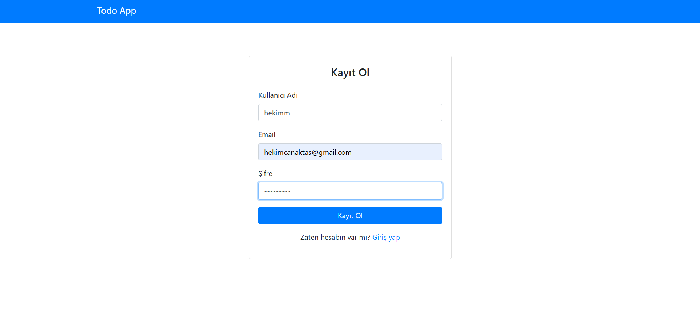
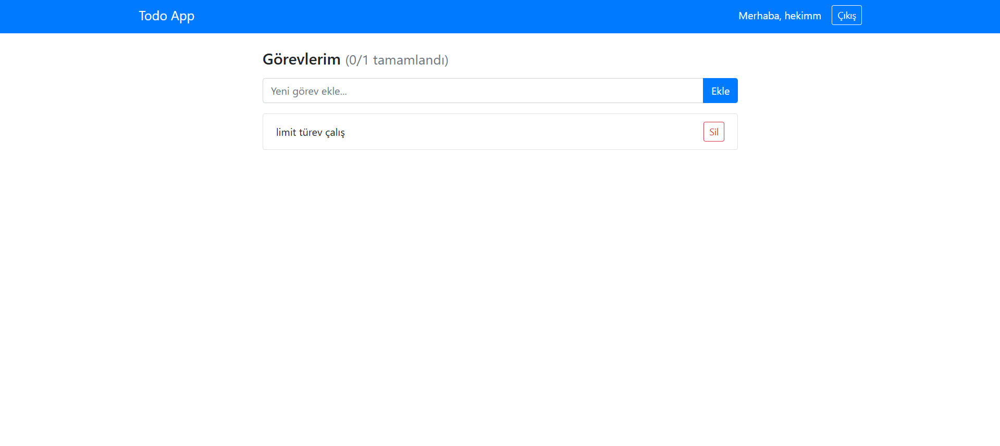
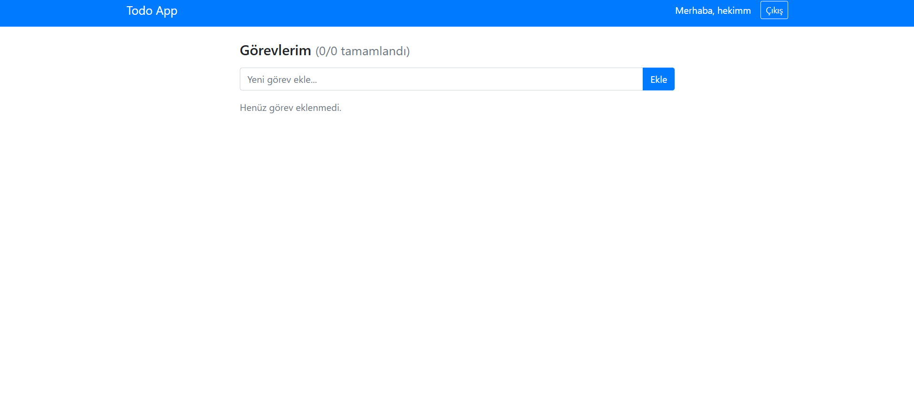
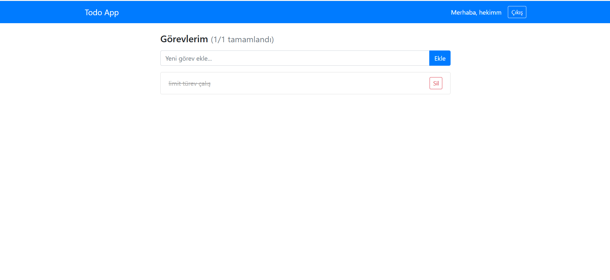

# Todo App - Fullstack MERN (2020)

> **Not:** Bu proje 2020'de, üniversite hazırlık dönemimde ilk fullstack
> uygulamamı yaparken oluşturdum. 2026'da portfolyomu düzenlerken GitHub'a
> yükledim. Kod o dönemki bilgi seviyemi yansıtıyor - bilinçli olarak
> modernize etmedim.

Önceki projelerde sadece HTML/CSS/JS kullanıyordum - burada ilk kez kendi backend'imi yazdım ve bir veritabanına bağlandım.

## Ekran Görüntüleri

<div align="center">
  
  <p><em>Kayıt Ekranı</em></p>
  
  
  <p><em>Todo Listesi - Görev Ekleme</em></p>
  
  
  <p><em>Boş Todo Listesi</em></p>
  
  
  <p><em>Tamamlanmış Görev</em></p>
</div>

JWT authentication'ı ve MongoDB'yi öğrenmek için yaptım. Başta token'ın nasıl çalıştığını tam anlayamadım ama birkaç gün sonra oturdu. CORS hatalarıyla da epey uğraştım.

## Ne öğrendim?

- REST API tasarımı ve endpoint yapısı
- JWT ile authentication (token'ı localStorage'da tutmak)
- MongoDB schema tasarımı ve Mongoose ORM
- React class component lifecycle (componentDidMount)
- CORS ve cross-origin istekler
- Heroku'ya fullstack uygulama deploy etmek
- Frontend-backend ayrımı ve API entegrasyonu

## Özellikler

- Kullanıcı kaydı ve girişi (JWT)
- Kullanıcıya özel todo listesi (başkasının görevleri görünmüyor)
- Görev ekleme, tamamlama, silme
- Heroku üzerinde canlıya aldım (ilk defa deploy yapıyordum!)

## Bilinen sorunlar

- Şifre validasyonu yok (minimum uzunluk vs.)
- Loading state'leri biraz basit
- Error handling daha iyi olabilir
- Token refresh mekanizması yok (7 günlük token kullandım)
- PropTypes veya TypeScript yok

## Teknolojiler

**Frontend:** React 16 (class components) · Bootstrap 4 · Axios · React Router v5  
**Backend:** Node.js · Express 4 · Mongoose 5  
**Veritabanı:** MongoDB Atlas  
**Auth:** JWT (jsonwebtoken · bcryptjs)  
**Deploy:** Heroku

## Kurulum

```bash
# Backend
cd server
npm install
# .env dosyasını oluştur (server klasöründe .env.example'a bak)
npm run dev

# Frontend (başka bir terminal aç)
cd client
npm install
npm start
```

Backend http://localhost:5000 üzerinde, frontend http://localhost:3000 üzerinde çalışacak.

## API Endpoints

| Method | URL | Açıklama | Auth |
|--------|-----|----------|------|
| POST | /api/auth/register | Kayıt | Hayır |
| POST | /api/auth/login | Giriş | Hayır |
| GET | /api/todos | Tüm todo'lar | Evet |
| POST | /api/todos | Todo ekle | Evet |
| PUT | /api/todos/:id | Toggle complete | Evet |
| DELETE | /api/todos/:id | Todo sil | Evet |

## O zamanlar yapmak istediğim şeyler

- [ ] Todo kategorileri
- [ ] Drag & drop sıralama
- [ ] Hooks kullanarak refactor yap
- [ ] Şifre sıfırlama özelliği
- [ ] Dark mode

## Lisans

MIT
